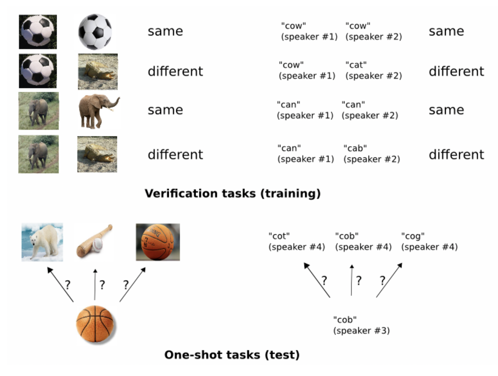
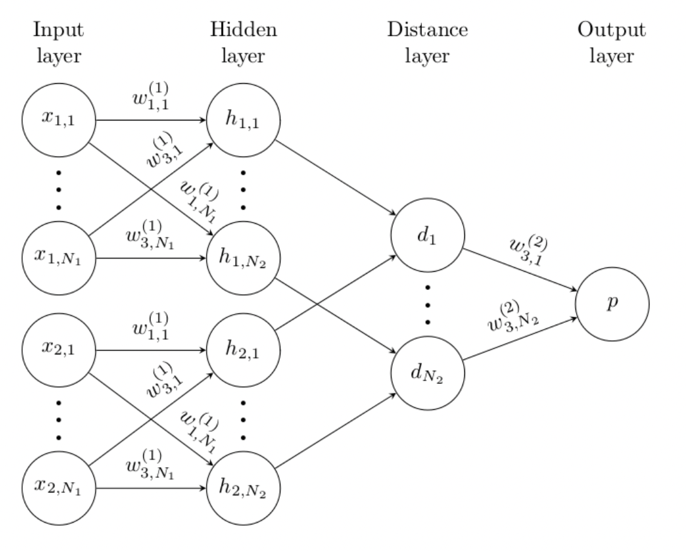
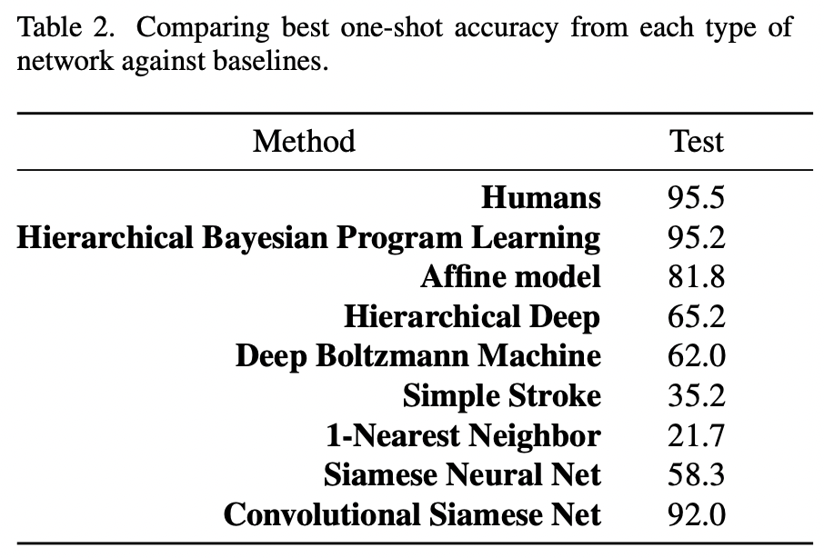

# Koch et al., 2015

> - Paper : [Siamese Neural Networks for One-shot Image Recognition](https://www.cs.cmu.edu/~rsalakhu/papers/oneshot1.pdf) 
> - Authors : Gregory Koch, Richard Zemel, Ruslan Salakhutdinov

## 요약
샴 신경망은 입력 데이터 쌍의 유사도를 비교하는 신경망을 학습한 뒤, 분산을 알 수 없는 새로운 샘플을 각 클래스에서 추출한 단 하나의 샘플과 비교해서 분류 작업을 수행한다. 샴 신경망은 이러한 one-shot learning에 획기적인 성과를 도출했다.

- 목표 : 주어진 데이터를 학습해 *재학습 없이* 정보가 적은 클래스에 대한 예측력을 높이고 싶다.

- **one-shot learning** ?
각 클래스에서 한개의 샘플만 가지는 데이터셋을 분류하는 과제다. 타깃 태스크를 위해 도메인에 특화된 데이터의 차이점을 중심으로 학습하므로 비슷한 인스턴스에서는 높은 성능을 내는 한편 다른 종류의 태스크에 대해서는 성능이 낮은 특성을 가진다(low robustness). 

## 본문

*이 논문에서는 문자 이미지 인식 과제에 대한 원-샷 러닝만 다루었다. 그렇지만 어떤 modality에 대해서도 적용할 수 있다.*

### 모델 개요

샴 신경망은 1️⃣검증 과제로 학습한 뒤 2️⃣원-샷 러닝으로 테스트된다. 각 클래스로부터 데이터 쌍을 만들어 일반적인 합성곱 신경망으로 이미지 표현(representation)을 지도 학습으로 학습한 뒤, 이 결과를 재학습 없이 원-샷 러닝에 이용했다.   

1. [training] 데이터를 이해하기 위한 DNN

    **학습 과제에 딥러닝을 사용한 이유** :
    1. 포괄적인 이미지의 특성 차이를 학습할 수 있다.
    2. 소스 데이터에서 뽑은 쌍에 대해 일반적인 신경망 최적화 방법을 사용할 수 있다. 
    3. 딥러닝은 비선형 레이어들로 입력 공간의 변형-불변(invariances to transformation) 성질을 찾아낸다. 즉 모델을 학습하는데에 강력한 가정이 필요하지 않으므로 도메인에 특화되지 않은 모델을 학습할 수 있다.

    학습 데이터로 이미지 쌍의 클래스-특성을 구별하는 신경망을 학습시킨다. 즉 검증을 잘 하는 네트워크는 샘플이 하나인 과제도 잘 할 것이라고 가정했다.

2. [test] 분산을 알 수 없는 데이터에 대한 원-샷 러닝

    검증 모델은 입력쌍이 같은 클래스인지 다른 클래스인지 구별한다. 학습된 검증 모델은 주어진 하나의 이미지와 각 클래스에 해당하는 테스트 이미지 한개씩과 비교하는데에 쓰인다. 비교에서 가장 유사도가 높은 테스트 이미지가 속한 클래스가 원-샷 과제에서 가장 높은 확률을 가지게 된다.

    만약 검증 모델에서 클래스를 구분하는 특성을 잘 학습했다면, 즉 모델이 학습된 클래스-특징의 분산을 포괄하는 다양한 예시에 노출되었다면, 새로운 예시에 대해서도 잘 예측할 수 있을 것이라고 가정했다.

### 깊은 샴 신경망

**쌍둥이 네트워크** ?

*위는 숨겨진 층이 단 두개인 쌍둥이 네트워크다. p를 로지스틱 회귀로 이진 분류하고 있다. 네트워크의 구조가 위아래로 대칭(쌍둥이)인 것을 확인할 수 있다. 또한 각 쌍둥이는 같은 파라미터를 공유한다.*

샴 신경망이 처음 소개된 것은 [Bromley et al., 1993]()으로, 서명 이미지를 구분하는데에 활용되었다. 
- (샴) 쌍둥이 네트워크는 대조적인 이미지 쌍을 입력해도 이후에 상위 특성 표현을 학습하는 에너지 함수에 의해 묶인다. 
- 이 네트워크는 마치 쌍둥이처럼 파라미터를 공유하는데, 이같은 가중치 결합은 비슷한 두개의 이미지가 각각의 네트워크에 의해 다른 특성 공간(feature map)으로 매핑되지 않게 보장한다. 
- 대칭적인 구조덕에 서로 다른 이미지를 입력해도 마치 쌍둥이 각각에 같은 이미지를 주입한 것 처럼 상위 레이어에서 같은 메트릭으로 계산한다.

[LeCun et al., 2005]()에서 저자들은 에너지 함수에 두가지 항을 두어 특성이 비슷한 쌍의 에너지는 감소하고 대조적인 쌍의 에너지는 증가하도록 고안했다. 이와 달리, 여기서는 쌍둥이 특성벡터 h1과 h2의 가중된 L1 거리와 sigmoid 활성화 함수를 모델 평가에 사용하였고, cross-entropy로 최적화했다.(이는 DeepFace의 접근 방법을 따른 것이다.) LeCun et al.에서는 에너지 손실로 유사도 메트릭을 직접 비교했지만, 이 논문에서는 메트릭을 고정시켜두었다.

특히 합성곱 신경망의 경우 대규모 컴퓨터 비전 식별 작업에 높은 성과를 냈다. 이것이 가능한 이유는 지역적 연결성(local connectivity)이 (선형 모델로 이미지를 다루는 것보다) 모델의 파라미터 수를 크게 감소시켜 그 자체로 표준화(regularization) 효과를 낼 수 있기 때문이다. 또한 이 네트워크의 합성곱은 직접 필터링한 효과를 낸다. 즉 각각의 피쳐맵이 입력 피쳐와 합성해 픽셀의 그룹 패턴을 식별하는 효과를 냈다. 마지막으로 CUDA 라이브러리 덕에 학습 속도를 가속할 수 있었다.

### 계산

*학습을 위한 모델 구조. fully-connected layer의 바로 다음 과정에서 두 쌍둥이가 L1 요소-거리로 결합된다.*

- $L$ : 네트워크 전체 레이어 개수
- $N_l$ : 각 레이어 l의 유닛 개수
- $h_{1, l}$ : l 레이어의 첫째 쌍둥이 hidden vector
- $h_{2, l}$ : l 레이어의 둘째 쌍둥이 hidden vector
- $W_{l-1, l}$ : l 레이어 피쳐맵의 3차원 텐서 표현식

네트워크는 아웃풋 피쳐맵에 ReLU 함수를 적용한 뒤 필터 크기와 stride가 2인 max-pooling을 적용하므로, k번째 필터맵은 다음 형식을 띈다.

$$
\begin{align}
a_{1, m}^{(k)} &= max-pool(max(0, W_{l-1, l}*h_{1,(l-1)} + b_l), 2) \\
a_{2, m}^{(k)} &= max-pool(max(0, W_{l-1, l}*h_{2,(l-1)} + b_l), 2)
\end{align}
$$

- 이때, 각 레이어의 히든 벡터는 두개지만 피쳐맵의 텐서 표현식은 동일함에 주목하자.

일반적인 합성곱 네트워크처럼, 마지막 합성곱 레이어는 fully-connected 칼럼 벡터로 변환되고 두 쌍둥이 벡터의 L1 거리를 계산해 하나의 sigmoid 아웃풋으로 연결된다. 즉 결과 벡터 $p$는 다음과 같이 계산된다.

$$
p = sigmoid(\sum_j \alpha_j|h_{1,L-1}^{(j)} - h_{2,L-1}^{(j)}|)
$$

마지막 레이어는 L-1번째 hidden 레이어의 피쳐맵에 대해 각 벡터의 거리를 각 요소(elementwise) 별로 계산해 더한 값이다. $\alpha_j$는 네트워크에서 학습되는 가중치 파라미터로, 각 요소 거리의 중요도를 나타낸다.

### 학습

- Loss function은 이진 cross-entropyloss로 정의했다. 미니배치 크기를 M, $y(x_1^{(i)}, x_2^{(i)})$가 길이 M인 미니배치의 라벨 벡터라 할때, loss는 다음과 같다.

    $$
    L(x_1^{(i)}, x_2^{(i)}) = y(x_1^{(i)}, x_2^{(i)}) log p(x_1^{(i)}, x_2^{(i)}) + (1-y(x_1^{(i)}, x_2^{(i)})) log(1- p(x_1^{(i)}, x_2^{(i)})) + \lambda^{T}|w|^2
    $$
    
    - $\lambda^{T}|w|^2$항은 loss를 clipping하며, 과적합을 방지하기 위해 더해지는 regularization 값이다.

- 쌍둥이는 파라미터를 공유하기 때문에, 역전파(backpropagation) 알고리즘은 각 쌍둥이의 그래디언트를 합하는 방식으로 진행한다. learning rate를 $\eta_j$, 모멘텀을 $\mu_j$, 그리고 레이어마다 정의된 $L_2$ regularization 가중치 $\lambda_j$에 대해 epoch T의 업데이트 방법은 다음과 같다.

    $$
    \begin{align}
    w_{kj}^{(T)}(x_1^{(i)}, x_2^{(i)}) &= w_{kj}^{(T)} + \Delta w_{kj}^{(T)}(x_1^{(i)}, x_2^{(i)}) + 2\lambda_j|w_{kj}| \\
    \Delta w_{kj}^{(T)}(x_1^{(i)}, x_2^{(i)}) &= -\eta_j \nabla w_{kj}^{(T)} + \mu_j \Delta w_{kj}^{(T-1)}
    \end{align}
    $$
    
    - 즉 그래디언트는 두 벡터에 대한 함수이고 $L_2$ regularization과 이전 에포크에 대한 모멘텀이 적용되었다.

- 모든 가중치는 $N(0, 10^{-2})$ 분포로 초기화했고, 편차는 $N(0.5, 10^{-2})$ 를 따랐다. 
    - 가중치를 0으로 초기화할 경우 학습이 진행되지 않으므로 보통 랜덤 초기화를 하는데, 여기서는 보다 학습을 안정적으로 하기 위해 정규 분포를 따르는 작은 값으로 초기화한 것으로 짐작된다.

- 하이퍼파라미터 최적화는 베이지안 최적화 프레임워크인 Whetlab을 사용하였으며, learning rate 및 러닝 스케줄과 합성곱 필터의 크기등을 원-샷 validation 정확도에 대해 최적화했다.

- 이 논문에서는 손글씨 데이터를 아핀 변형(Affine Distortions)으로 증가(augment)시켰다. 데이터 쌍 $(x_1, x_2)$ 가 있을 때 각각에 해당하는 아핀 변형 $T_1, T_2$ 으로 변형 데이터 쌍 $(x_1\prime, x_2\prime)$ 을 생성했다. 이때 연산 $T_1, T_2$ 는 다변수 균등 분포를 따라 확률적으로 결정되도록 했다.   

### 실험 및 성능 

- 학습은 50개 언어의 알파벳 손글씨 이미지 데이터셋 Omniglot에 대해 진행하였다. 

- 실험은 3만개, 6만개, 15만 개의 랜덤으로 추출한 같거나 다른 쌍에 대해 진행하였다. 50개의 언어 중 60%인 30개의 언어와 20명의 작성자 중 60%인 12개의 작성자 데이터를 활용하고, 나머지는 최적화와 테스트를 위해 남겨두었다.

- 특히, 최적화 과정에서 같은 (차원의) 표현식을 갖기 위해 각 언어에 대해 샘플 개수를 일정한 값으로 제한했다. 그리고 제한된 샘플에 대해 아핀 변환을 수행하고 다시 8개의 변환을 수행해 각각 27만개, 81만개, 135만개 데이터를 확보했다.

- 원-샷 러닝에서 C개의 카테고리가 있다고 할때, $c \in C$이고 ${x_c}$ 가 각 카테고리의 이미지 샘플일 때, 원-샷 러닝의 예측값 $C^*$는 타겟 이미지 $x$ 와 $x_c$ 간의 확률 $p^{(c)}$ 에 대해 다음과 같다. 
 
    $$
    C^* = {argmax}_c p^{(c)}
    $$

- 테스트 결과 Hierarchical Bayesian Program Learning을 제외하고 비교 대상중 92%의 합성곱 방법보다 높은 성능을 보였다. HBPL은 데이터에 대한 사전 지식을 활용한 것에 비해 샴 신경망은 범용성이 높다는 점에서 의의가 있다.
    

- MNIST 데이터셋은 학습할 데이터의 샘플 개수보다도 테스트할 클래스의 개수가 더 많은 경우이다. Omniglot 데이터에 대해 학습한 모델을 MNIST 데이터셋에 원-샷 테스트 했을 때 정확도가 많이 떨어지기는 하지만, 여전히 유의한(70.3 > 10 *숫자가 10개 이므로) 성능을 확인할 수 있었다.
